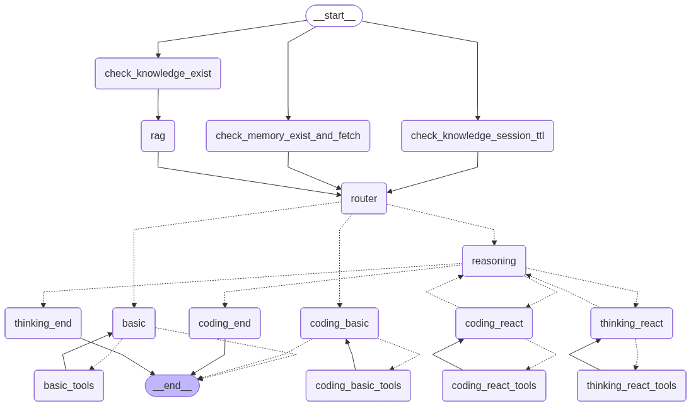
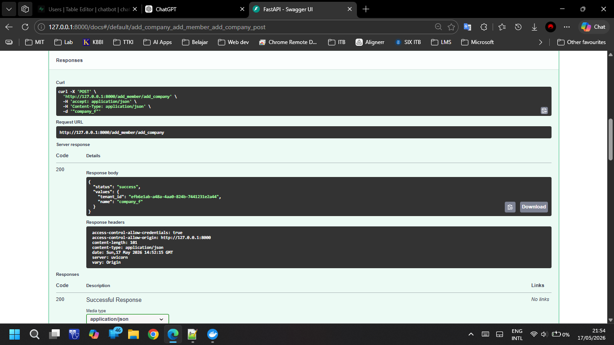
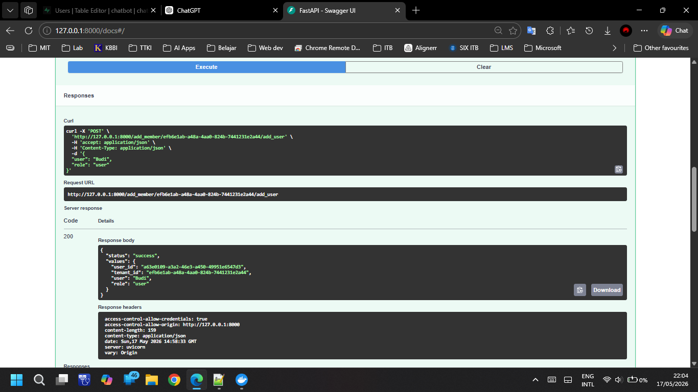
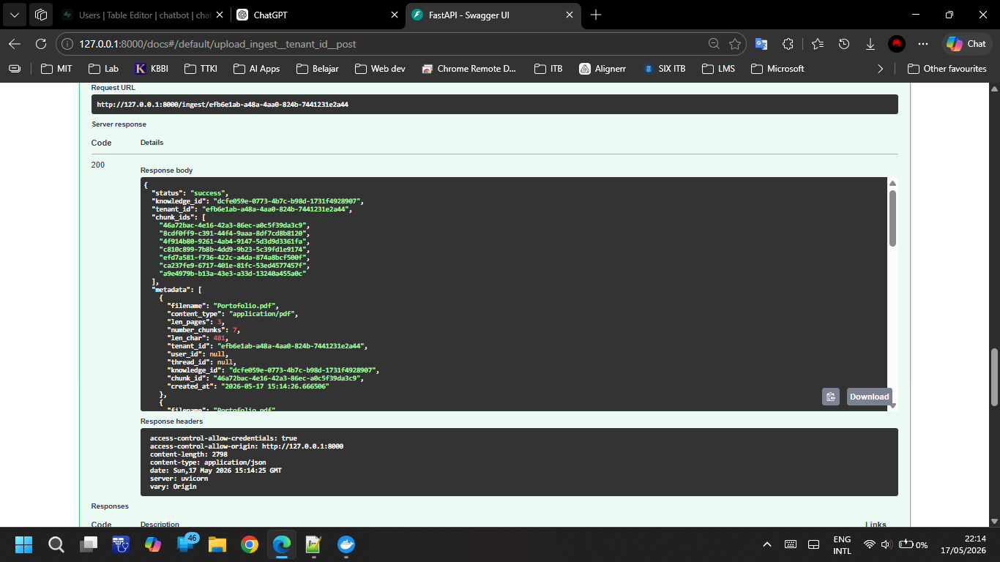
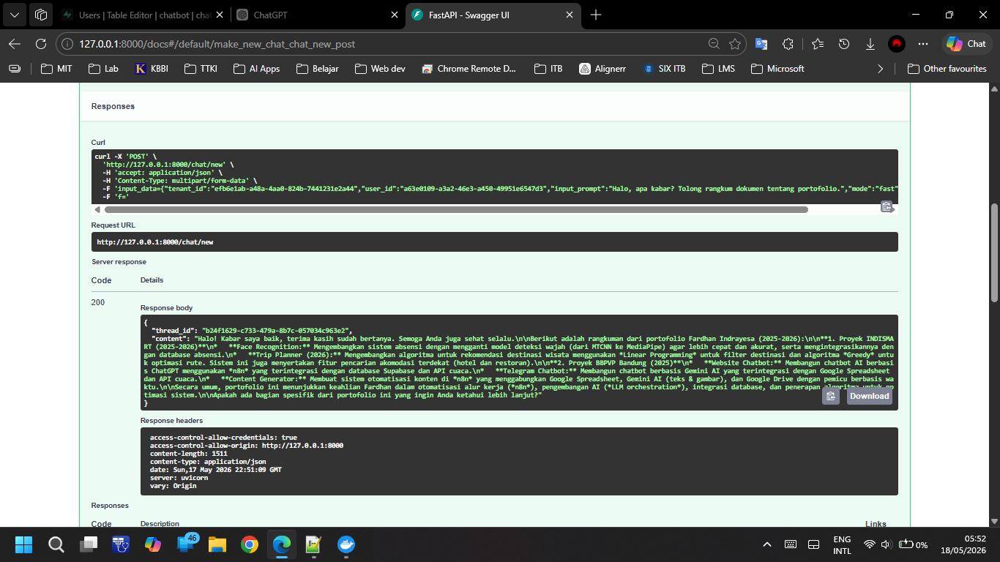
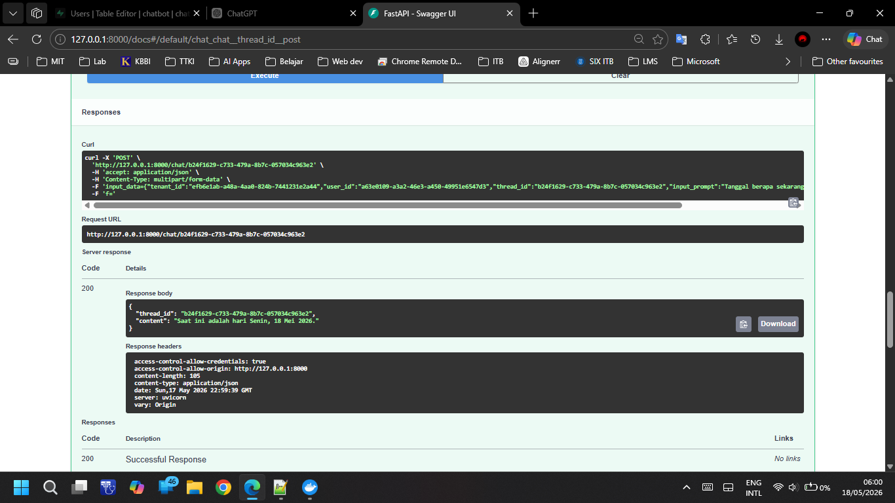

# Chatbot-Aries

## Cara Setup
1. Pastikan Docker sudah terinstall

2. Clone repository ini
```
git clone https://github.com/fardhan248/aries.git
```

3. Masuk ke direktori project
```
cd aries
```

4. Buat atau tempel file .env di direktori `/aries` (Untuk menyimpan history chat dan checkpoint Langgraph ke database)

5. Download Model LLM dan Embedding dari Hugging Face
```
wget -P ./model_files/ https://huggingface.co/Qwen/Qwen3-Embedding-0.6B-GGUF/resolve/main/Qwen3-Embedding-0.6B-Q8_0.gguf https://huggingface.co/Qwen/Qwen3-0.6B-GGUF/resolve/main/Qwen3-0.6B-Q8_0.gguf
```

6. Run docker compose dengan perintah
```
docker compose -f docker-compose.yml up -d
```

7. Buka Swagger FastAPI, dengan menyalin link berikut ke browser
```
http://localhost:8000/docs
```

## Cara Run
1. Cek health server dengan endpoint `/health`

2. Daftar nama tenant dengan endpoint `/add_member/add_company`

	Format input `/add_member/add_company`:

	Request body:
	```text
	"<string_tenant_name>"
	```

3. Masukkan nama user dengan endpoint `/add_member/{tenant_id}/add_user`

	Format input `/add_member/{tenant_id}/add_user`:

	Parameter:
	```text
	<string_path_tenant_id>
	```
	Request body:
	```json
	{
		"user": "<user_string>",
		"role": "user"
	}
	```
	User Roles: super_admin, admin, user

4. Upload knowledge tambahan dengan endpoint `/ingest/{tenant_id}`

	Format input `/ingest/{tenant_id}`:

	Parameter:
	```text
	<string_path_tenant_id> 
	```
	Request body:
	```text
	f (file upload)
	```

5. Buat chat baru dengan endpoint `/chat/new`

	Format input `/chat/new`:

	Request body: input_data (string)
	```json
	{
		"tenant_id": "<tenant_id>", 
		"user_id": "<user_id>", 
		"input_prompt": "<prompt>", 
		"mode": "fast", 
		"streaming": false
	}
	```
	Request body:
	```text
	f (file upload)
	```
	Mode: auto, fast, thinking

6. Lanjutkan chat dengan memasukkan thread_id di endpoint `/chat/{thread_id}`

	Format input `/chat/{thread_id}`

	Parameter:
	```text
	<string_path_thread_id>
	```
	Request body: input_data (string)
	```json
	{
		"tenant_id": "<tenant_id>", 
		"user_id": "<user_id>", 
		"thread_id": "<thread_id>",
		"input_prompt": "<prompt>", 
		"mode": "fast", 
		"streaming": false
	}
	```
	Request body:
	```text
	f (file upload)
	```

## Arsitektur

Chatbot RAG yang context-aware dibuat dengan menggunakan framework Langchain-Langgraph dan menggunakan ChromaDB sebagai vector database. Fitur yang tersedia pada chatbot ini, di antaranya fitur untuk chat streaming maupun chat biasa, berbagai tools seperti get datetime dan web search, penambahan memory secara otomatis oleh LLM, dan upload file per session.

Sekilas tentang Langgraph:
- **Langgraph**: Framework open source dari LangChain untuk membangun dan mengelola alur AI Agent dengan struktur berbasis graf.
- **State**: Mekanisme utama untuk komunikasi antar node yang bertindak sebagai pesan terstruktur yang merangkum snapshot sistem saat ini pada setiap momen tertentu.
- **Checkpoint**: Berguna untuk mempertahankan data state di dalam dan di seluruh interaksi sistem graf.

Penjelasan workflow dan node:
- Ketika user mengirim prompt, node langgraph otomatis mengecek riwayat percakapan sebelumnya, apakah ada knowledge (**tenant knowledge**, **session knowledge**, **memory**) yang pernah dibahas dalam session itu atau tidak. Jika terdapat knowledge, maka chunk setiap knowledge akan di fetch ke dalam state Langgraph. Data chunk tidak disimpan ke database checkpoint Langgraph karena untuk efisiensi penggunaan storage database serta interaksi antara checkpoint Langgraph dengan database yang lebih lancar. 
- kemudian, pada node **RAG**, prompt user akan diproses oleh LLM untuk direkonstruksi query-nya agar query yang di-embed ke vector memiliki makna semantik yang sesuai dengan knowledge yang ada di vector database. Untuk menghindari duplikasi, di node ini juga terdapat logic untuk fallback ketika terdapat chunk_id yang sudah ada di state Langgraph agar tidak duplikat.
- Setelah itu, knowledge yang tersedia dan prompt dari user di-query ke LLM yang ada di node **router**. Node ini berperan untuk mengarahkan workflow, agent mana yang akan digunakan sesuai dengan query user. Terdapat route **basic**, **coding basic**, dan **reasoning** (**thinking react** dan **coding react**).
- Route **basic** dan **coding basic** hanya menjawab pertanyaan yang sederhana dari user. Disediakan pula node **tools** yang dapat diakses oleh LLM.
- Route **reasoning** menjawab pertanyaan dari user yang membutuhkan pemikiran mendalam, analisis masalah yang kompleks, serta problem solving yang kuat. Pada state Langgraph terdapat data "route" sebagai arah bagi workflow untuk mengarahkan antara **coding react** atau **thinking react**.
- Pada node **reasoning**, query dari user diproses menjadi bentuk pertanyaan yang lebih dalam, lalu pertanyaan tersebut dijawab di node **coding/thinking react**. Node **react** ini terhubung dengan node **tools**, sehingga LLM pada node **react** dapat menjawab dengan lebih substansial terhadap pertanyaan yang dibuat pada node **reasoning**.
- Setelah jawaban dibuat, node **reasoning** memproses hasil observasi node **react** untuk dibuat pertanyaan lanjutan sampai 3 kali, supaya jawaban yang dihasilkan ke user lebih komprehensif.
- Setelah iterasi dilakukan sebanyak 3 kali, node **reasoning** langsung menuju node **coding/thinking end**. Di node **end** ini, pertanyaan hasil reasoning dan jawaban hasil observasi di node **reasoning** dan **react**, disimpulkan secara lebih ringkas namun tetap jelas untuk disampaikan kepada user.

Tools yang tersedia:
| Function | Deskripsi |
|---|---|
| `put_new_memory` | Menambahkan memory user secara otomatis ke dalam vector database |
| `fetch_new_knowlegde` | Menambahkan knowledge tenant tambahan apabila LLM membutuhkan konteks/knowledge yang lebih jelas dan luas. |
| `fetch_new_knowlegde_session` | Menambahkan knowledge session (yang di-upload setiap user) tambahan apabila LLM membutuhkan konteks/knowledge yang lebih jelas dan luas. |
| `fetch_new_memory` | Menambahkan konteks memori user untuk menambah konteks pada setiap percakapan. |
| `calculator` | Kalkulator sederhana untuk query yang membutuhkan perhitungan. |
| `web_search` | Fitur pencarian web digunakan ketika tidak ada knowledge yang relevan atau query user yang menuntut untuk mencari lebih jauh tentang suatu topik. |
| `get_datetime_now` | Mendapatkan waktu saat ini pada LLM. |

## Hasil
### Endpoint `/health`

output:
```json
{
  "ollama_llm": {
	"status": "success",
	"content": {
	  "models": [
		{
		  "name": "qwen_llm:latest",
		  "model": "qwen_llm:latest",
		  "modified_at": "2026-05-17T10:19:00.0982248Z",
		  "size": 639446954,
		  "digest": "09ad5fb1a383f20b7d8fdda04fcea1a08ebe008fe3a2982d9e7b02fed6686c49",
		  "details": {
			"parent_model": "",
			"format": "gguf",
			"family": "qwen3",
			"families": [
			  "qwen3"
			],
			"parameter_size": "596.05M",
			"quantization_level": "Q8_0"
		  }
		}
	  ]
	}
  },
  "ollama_embedding": {
	"status": "success",
	"content": {
	  "models": [
		{
		  "name": "qwen_embedding:latest",
		  "model": "qwen_embedding:latest",
		  "modified_at": "2026-05-17T10:18:10.287941476Z",
		  "size": 639150858,
		  "digest": "74aa379231f61b1adc709bf515d79f914fd120e336ca701013e5fde44b44bd9d",
		  "details": {
			"parent_model": "",
			"format": "gguf",
			"family": "qwen3",
			"families": [
			  "qwen3"
			],
			"parameter_size": "595.78M",
			"quantization_level": "Q8_0"
		  }
		}
	  ]
	}
  },
  "asyncpg_pool": {
	"status": "success",
	"content": true
  },
  "chromadb": {
	"status": "success",
	"content": "{\"nanosecond heartbeat\":1779013508279173283}"
  },
  "chromadb_example": {
	"status": "success",
	"content": []
  }
}
```

### Endpoint `/add_member/add_company`

Input:

Request body:
```text
"company_f"
```
Curl:
```bash
curl -X 'POST' \
  'http://127.0.0.1:8000/add_member/add_company' \
  -H 'accept: application/json' \
  -H 'Content-Type: application/json' \
  -d '"company_f"'
```
Output:

```
{
  "status": "success",
  "values": {
	"tenant_id": "efb6e1ab-a48a-4aa0-824b-7441231e2a44",
	"name": "company_f"
  }
}
```

### Endpoint `/add_member/{tenant_id}/add_user`

Input:

Path parameter (tenant_id):
```text
efb6e1ab-a48a-4aa0-824b-7441231e2a44
```
Request body:
```json
{
	"user": "Budi",
	"role": "user"
}
```
Curl:
```bash
curl -X 'POST' \
  'http://127.0.0.1:8000/add_member/efb6e1ab-a48a-4aa0-824b-7441231e2a44/add_user' \
  -H 'accept: application/json' \
  -H 'Content-Type: application/json' \
  -d '{
  "user": "Budi",
  "role": "user"
}'
```
output:

```
{
  "status": "success",
  "values": {
	"user_id": "a63e0109-a3a2-46e3-a450-49951e6547d3",
	"tenant_id": "efb6e1ab-a48a-4aa0-824b-7441231e2a44",
	"user": "Budi",
	"role": "user"
  }
}
```

### Endpoint `/ingest/{tenant_id}`

Input:

Parameter (tenant_id):
```text
efb6e1ab-a48a-4aa0-824b-7441231e2a44
```
Request body:
```text
f (file upload): Portofolio.pdf
```
Curl:
```bash
curl -X 'POST' \
  'http://127.0.0.1:8000/ingest/efb6e1ab-a48a-4aa0-824b-7441231e2a44' \
  -H 'accept: application/json' \
  -H 'Content-Type: multipart/form-data' \
  -F 'f=@Portofolio.pdf;type=application/pdf'
```
output:

```
{
  "status": "success",
  "knowledge_id": "dcfe059e-0773-4b7c-b98d-1731f4928907",
  "tenant_id": "efb6e1ab-a48a-4aa0-824b-7441231e2a44",
  "chunk_ids": [
	"46a72bac-4e16-42a3-86ec-a0c5f39da3c9",
	"8cdf0ff9-c391-44f4-9aaa-8df7cd8b8120",
	"4f914b80-9261-4ab4-9147-5d3d9d3361fa",
	"c810c899-7b8b-4dd9-9b23-5c39fd1e9174",
	"efd7a581-f736-422c-a4da-874a8bcf500f",
	"ca237fe9-6717-401e-81fc-53ed4577457f",
	"a9e4979b-b13a-43e3-a33d-13240a455a0c"
  ],
  "metadata": [
	{
	  "filename": "Portofolio.pdf",
	  "content_type": "application/pdf",
	  "len_pages": 3,
	  "number_chunks": 7,
	  "len_char": 481,
	  "tenant_id": "efb6e1ab-a48a-4aa0-824b-7441231e2a44",
	  "user_id": null,
	  "thread_id": null,
	  "knowledge_id": "dcfe059e-0773-4b7c-b98d-1731f4928907",
	  "chunk_id": "46a72bac-4e16-42a3-86ec-a0c5f39da3c9",
	  "created_at": "2026-05-17 15:14:26.666506"
	},
	{
	  "filename": "Portofolio.pdf",
	  "content_type": "application/pdf",
	  "len_pages": 3,
	  "number_chunks": 7,
	  "len_char": 498,
	  "tenant_id": "efb6e1ab-a48a-4aa0-824b-7441231e2a44",
	  "user_id": null,
	  "thread_id": null,
	  "knowledge_id": "dcfe059e-0773-4b7c-b98d-1731f4928907",
	  "chunk_id": "8cdf0ff9-c391-44f4-9aaa-8df7cd8b8120",
	  "created_at": "2026-05-17 15:14:26.666682"
	},
	{
	  "filename": "Portofolio.pdf",
	  "content_type": "application/pdf",
	  "len_pages": 3,
	  "number_chunks": 7,
	  "len_char": 474,
	  "tenant_id": "efb6e1ab-a48a-4aa0-824b-7441231e2a44",
	  "user_id": null,
	  "thread_id": null,
	  "knowledge_id": "dcfe059e-0773-4b7c-b98d-1731f4928907",
	  "chunk_id": "4f914b80-9261-4ab4-9147-5d3d9d3361fa",
	  "created_at": "2026-05-17 15:14:26.666692"
	},
	{
	  "filename": "Portofolio.pdf",
	  "content_type": "application/pdf",
	  "len_pages": 3,
	  "number_chunks": 7,
	  "len_char": 465,
	  "tenant_id": "efb6e1ab-a48a-4aa0-824b-7441231e2a44",
	  "user_id": null,
	  "thread_id": null,
	  "knowledge_id": "dcfe059e-0773-4b7c-b98d-1731f4928907",
	  "chunk_id": "c810c899-7b8b-4dd9-9b23-5c39fd1e9174",
	  "created_at": "2026-05-17 15:14:26.666699"
	},
	{
	  "filename": "Portofolio.pdf",
	  "content_type": "application/pdf",
	  "len_pages": 3,
	  "number_chunks": 7,
	  "len_char": 441,
	  "tenant_id": "efb6e1ab-a48a-4aa0-824b-7441231e2a44",
	  "user_id": null,
	  "thread_id": null,
	  "knowledge_id": "dcfe059e-0773-4b7c-b98d-1731f4928907",
	  "chunk_id": "efd7a581-f736-422c-a4da-874a8bcf500f",
	  "created_at": "2026-05-17 15:14:26.666712"
	},
	{
	  "filename": "Portofolio.pdf",
	  "content_type": "application/pdf",
	  "len_pages": 3,
	  "number_chunks": 7,
	  "len_char": 477,
	  "tenant_id": "efb6e1ab-a48a-4aa0-824b-7441231e2a44",
	  "user_id": null,
	  "thread_id": null,
	  "knowledge_id": "dcfe059e-0773-4b7c-b98d-1731f4928907",
	  "chunk_id": "ca237fe9-6717-401e-81fc-53ed4577457f",
	  "created_at": "2026-05-17 15:14:26.666718"
	},
	{
	  "filename": "Portofolio.pdf",
	  "content_type": "application/pdf",
	  "len_pages": 3,
	  "number_chunks": 7,
	  "len_char": 211,
	  "tenant_id": "efb6e1ab-a48a-4aa0-824b-7441231e2a44",
	  "user_id": null,
	  "thread_id": null,
	  "knowledge_id": "dcfe059e-0773-4b7c-b98d-1731f4928907",
	  "chunk_id": "a9e4979b-b13a-43e3-a33d-13240a455a0c",
	  "created_at": "2026-05-17 15:14:26.666724"
	}
  ]
}
```

### Endpoint `/chat/new`

Input:

Request body: input_data (string)
```json
{
	"tenant_id": "efb6e1ab-a48a-4aa0-824b-7441231e2a44", 
	"user_id": "a63e0109-a3a2-46e3-a450-49951e6547d3", 
	"input_prompt": "Halo, apa kabar? Tolong rangkum dokumen tentang portofolio.", 
	"mode": "fast", 
	"streaming": false
}
```
output:

```
{
  "thread_id": "b24f1629-c733-479a-8b7c-057034c963e2",
  "content": "Halo! Kabar saya baik, terima kasih sudah bertanya. Semoga Anda juga sehat selalu.\n\nBerikut adalah rangkuman dari portofolio Fardhan Indrayesa (2025-2026):\n\n**1. Proyek INDISMART (2025-2026)**\n*   **Face Recognition:** Mengembangkan sistem absensi dengan mengganti model deteksi wajah (dari MTCNN ke MediaPipe) agar lebih cepat dan akurat, serta mengintegrasikannya dengan database absensi.\n*   **Trip Planner (2026):** Mengembangkan algoritma untuk rekomendasi destinasi wisata menggunakan *Linear Programming* untuk filter destinasi dan algoritma *Greedy* untuk optimasi rute. Sistem ini juga menyertakan fitur pencarian akomodasi terdekat (hotel dan restoran).\n\n**2. Proyek BBPVP Bandung (2025)**\n*   **Website Chatbot:** Membangun chatbot AI berbasis ChatGPT menggunakan *n8n* yang terintegrasi dengan database Supabase dan API cuaca.\n*   **Telegram Chatbot:** Membangun chatbot berbasis Gemini AI yang terintegrasi dengan Google Spreadsheet dan API cuaca.\n*   **Content Generator:** Membuat sistem otomatisasi konten di *n8n* yang menggabungkan Google Spreadsheet, Gemini AI (teks & gambar), dan Google Drive dengan pemicu berbasis waktu.\n\nSecara umum, portofolio ini menunjukkan keahlian Fardhan dalam otomatisasi alur kerja (*n8n*), pengembangan AI (*LLM orchestration*), integrasi database, dan penerapan algoritma untuk optimasi sistem.\n\nApakah ada bagian spesifik dari portofolio ini yang ingin Anda ketahui lebih lanjut?"
}
```

### Endpoint `/chat/{thread_id}`

Input:

Parameter (thread_id):
```text
b24f1629-c733-479a-8b7c-057034c963e2
```
Request body: input_data (string)
```json
{
	"tenant_id": "efb6e1ab-a48a-4aa0-824b-7441231e2a44", 
	"user_id": "a63e0109-a3a2-46e3-a450-49951e6547d3",
	"thread_id": "b24f1629-c733-479a-8b7c-057034c963e2",
	"input_prompt": "Tanggal berapa sekarang?", 
	"mode": "fast", 
	"streaming": false
}
```

output:

```
{
  "thread_id": "b24f1629-c733-479a-8b7c-057034c963e2",
  "content": "Saat ini adalah hari Senin, 18 Mei 2026."
}
```